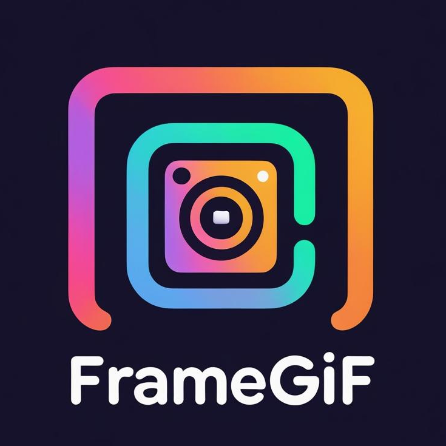
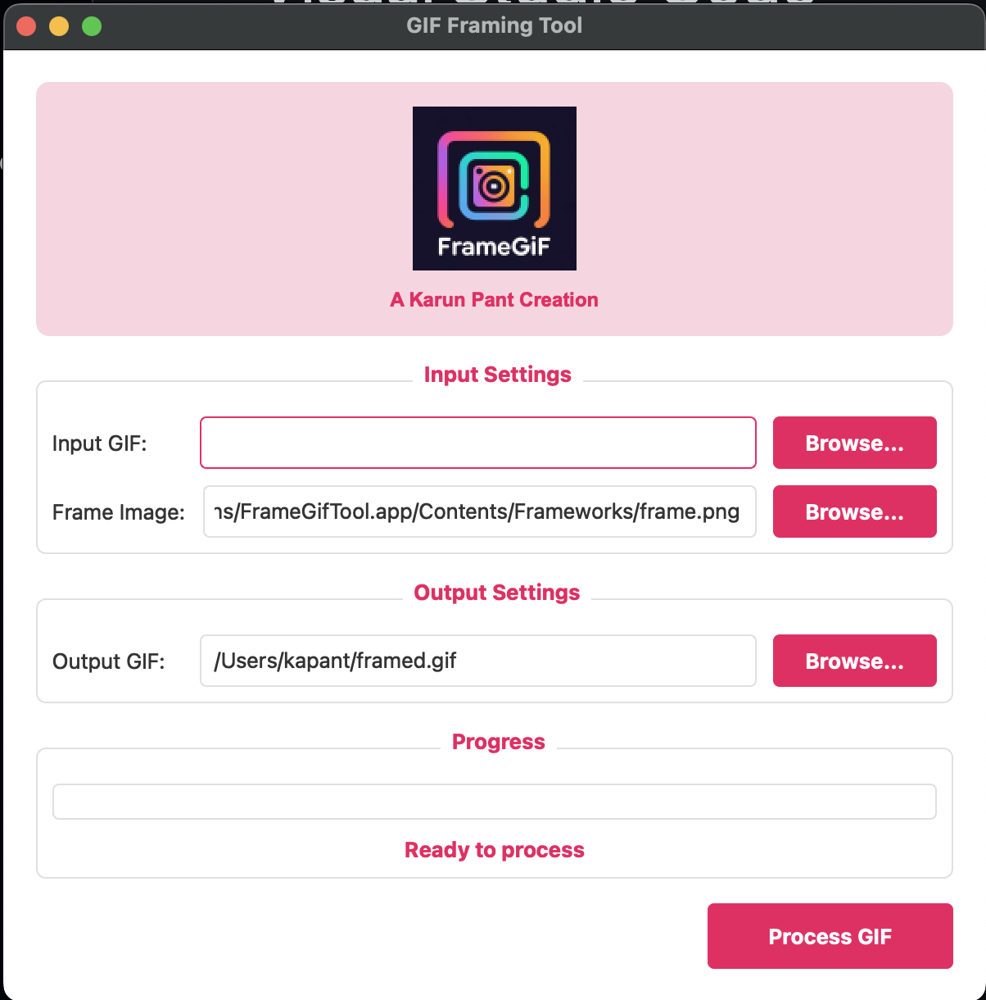

# Frame GIF Tool

A simple tool for framing GIFs with device frames.



## Installation

### From source

```bash
git clone https://github.com/karun-pant/gif-tools.git
cd gif-tools
./make_mac_app.sh
```

### Mac App

- A standalone Mac application is available for download from the [releases page](https://github.com/karun-pant/gif-tools/releases).
- If it doesn't work as expected, follow the steps after downloading the code.
- Also, please report issues on the GitHub repository.




## Features

- Load any GIF and overlay it on a device frame
- Automatically resizes GIF to fit the frame
- Adds rounded corners to match device aesthetics
- Saves the framed GIF to your desired location
